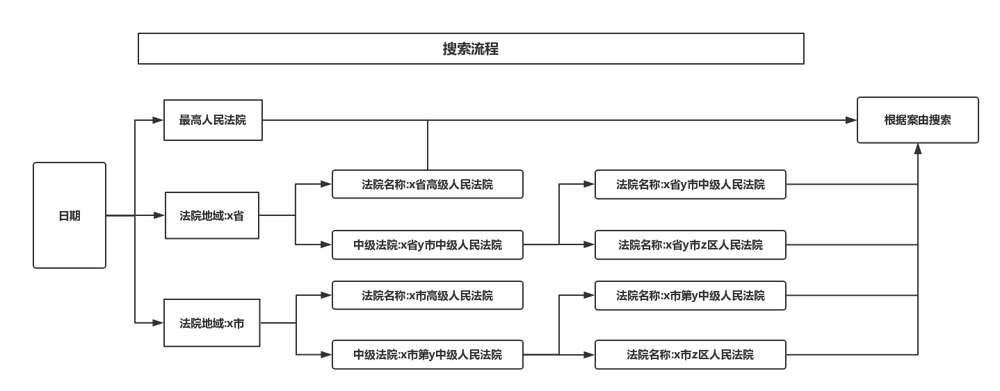
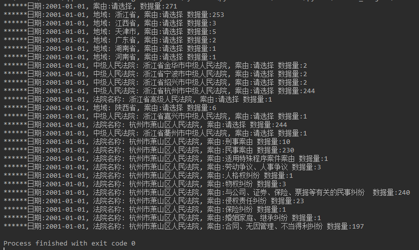
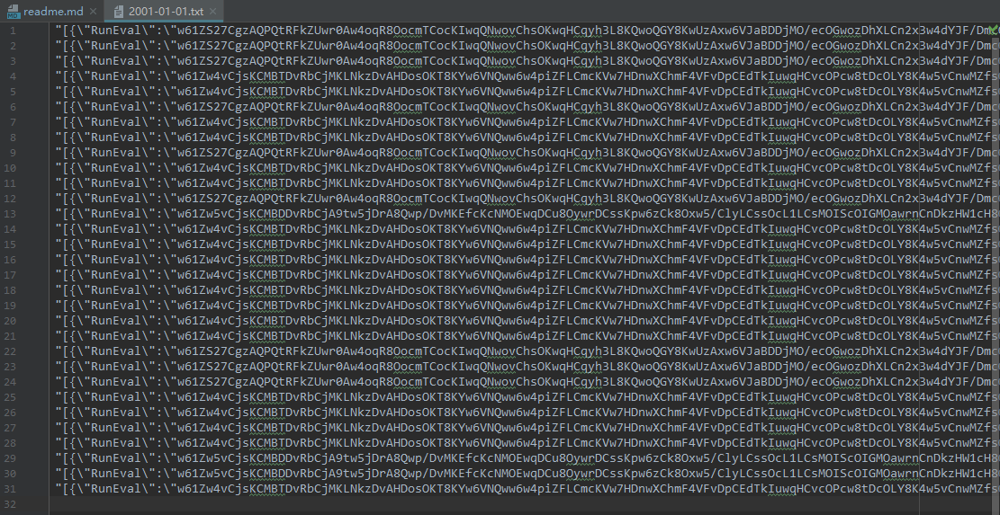
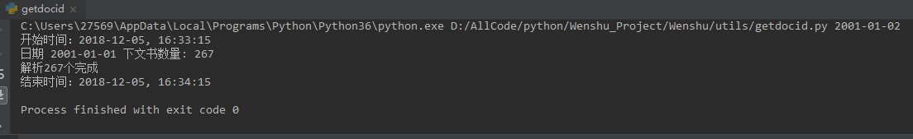
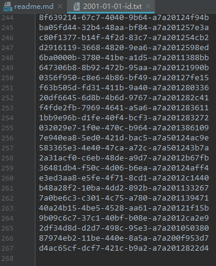
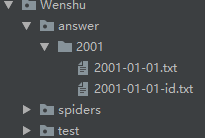

## 裁判文书网爬虫项目

### 爬虫思路

### 运行效果
#### 运行过程截图

#### 生成文件

#### 本地解密过程

#### 解密生成文件

#### answer文件夹

### 运行环境
- python3.6
- pycharm
- scrapy
- nodejs
- 反正准备环境可能会有很多问题，慢慢百度能解决

### 运行
1. 文书网的反爬很严格，我用了公司的代理，换用阿布云代理也可以，代码都在中间件文件下

2. 要修改两处日期
    - Wenshu/settings.py 的 BEGIN_DATE, END_DATE  
    - Wenshu/utils/getdocid.py 的 begin_date 和 end_date

3. 先运行cmdline，可以生成(日期.txt)，然后运行getdocid，解析出实际的docid文件

4. 因为以后要扩展成分布式爬虫，所以暂时写成这样，公司暂时同意我将代码保存在github上开源